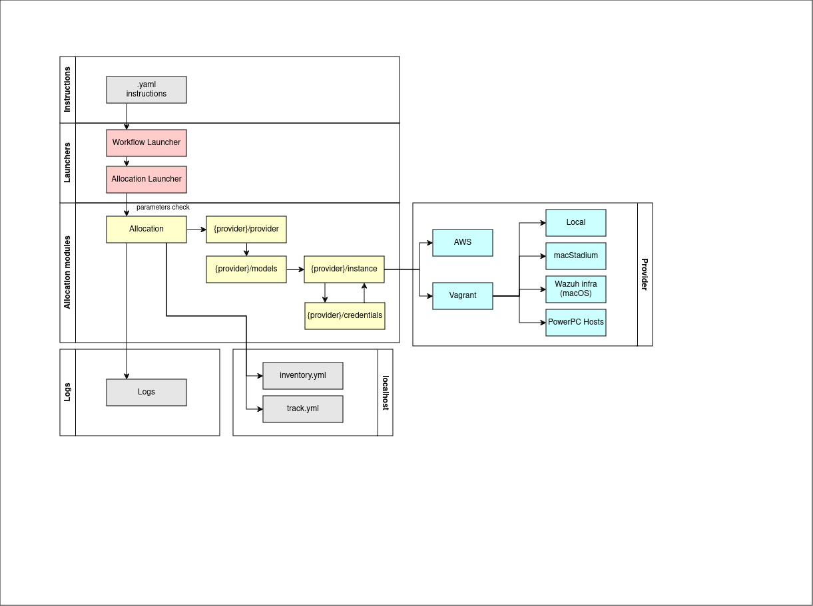

## Allocation Module

### User documentation

The Allocation module allows you to create and destroy VMs both locally and in AWS, it also gives the possibility of creating macOS VMs on Wazuh infrastructure or PowerPC VMs, as long as you have the necessary permissions to do so. VMs can be AMD64, ARM64, Windows, macOS (Intel and ARM), and PowerPC (Centos and Debian).

#### Set the environment

The execution of the allocation is carried out through the Workflow library, or by executing them manually through commands.
Execution can be done from any operating system.

Initially, You must install Python libraries. We recommend to use virtual environments. Follow the technical documentation at https://docs.python.org/3/library/venv.html.

1. Activate the environment:

  ```bash
  source {venv directory}/bin/activate
  ```

2. Clone the `wazuh-qa` repository:

  Navigate to the project directory and switch to the project branch:

  ```bash
  cd wazuh-qa
  git checkout {project-branch}
  ```
> Note: temporary dev project-branch is [enhancement/4495-DTT1](https://github.com/wazuh/wazuh-qa/tree/enhancement/4495-DTT1)

3. Install requirements:

  ```bash
  pip3 install -r deployability/deps/requirements.txt
  ```

#### Use the Allocation module through the Workflow

Now, it is possible to use the worklow engine library to launch the provision module by doing the following steps:

1. Install the Workflow engine library and its launcher:

  While in wazuh-qa:

  ```bash
  cd modules
  pip3 uninstall -y workflow_engine && pip3 install .
  ```

2. Test Fixture to Execute:

      It will be necessary to create a fixture (yaml file) where the infrastructure, provisioning, and tests to be executed will be declared.

      >Note: It is possible to find some fixture examples in [deployability/modules/workflow_engine/examples/](../workflow_engine/examples)

      Example:

      ```bash
      version: 0.1
      description: This workflow is used to test agents' deployment for DDT1 PoC
      variables:
        agents-os:
          - linux-ubuntu-22.04-amd64
        manager-os: linux-ubuntu-22.04-amd64
        infra-provider: vagrant
        working-dir: /tmp/dtt1-poc

      tasks:
        # Generic agent test task
        - task: "run-agent-tests-{agent}"
          description: "Run tests uninstall for the {agent} agent."
          do:
            this: process
            with:
              path: python3
              args:
                - modules/testing/main.py
                - inventory: "{working-dir}/agent-{agent}/inventory.yaml"
                - dependencies:
                  - manager: "{working-dir}/manager-{manager-os}/inventory.yaml"
                  - agent: "{working-dir}/agent-{agent}/inventory.yaml"
                - tests: "install,register,stop"
                - component: "agent"
                - wazuh-version: "4.7.1"
                - wazuh-revision: "40709"
          depends-on:
            - "provision-install-{agent}"
            - "provision-manager"
          foreach:
            - variable: agents-os
              as: agent

        # Generic agent test task
        - task: "run-agent-tests-uninstall-{agent}"
          description: "Run tests uninstall for the {agent} agent."
          do:
            this: process
            with:
              path: python3
              args:
                - modules/testing/main.py
                - inventory: "{working-dir}/agent-{agent}/inventory.yaml"
                - dependencies:
                  - manager: "{working-dir}/manager-{manager-os}/inventory.yaml"
                - tests: "uninstall"
                - component: "agent"
                - wazuh-version: "4.7.1"
                - wazuh-revision: "40709"
          depends-on:
            - "run-agent-tests-{agent}"
            - "provision-uninstall-{agent}"
          foreach:
            - variable: agents-os
              as: agent

        # Unique manager provision task
        - task: "provision-manager"
          description: "Provision the manager."
          do:
            this: process
            with:
              path: python3
              args:
                - modules/provision/main.py
                - inventory-manager: "{working-dir}/manager-{manager-os}/inventory.yaml"
                - install:
                  - component: wazuh-manager
                    type: package
          depends-on:
            - "allocate-manager"

        # Unique manager allocate task
        - task: "allocate-manager"
          description: "Allocate resources for the manager."
          do:
            this: process
            with:
              path: python3
              args:
                - modules/allocation/main.py
                - action: create
                - provider: "{infra-provider}"
                - size: large
                - composite-name: "{manager-os}"
                - inventory-output: "{working-dir}/manager-{manager-os}/inventory.yaml"
                - track-output: "{working-dir}/manager-{manager-os}/track.yaml"
          cleanup:
            this: process
            with:
              path: python3
              args:
                - modules/allocation/main.py
                - action: delete
                - track-output: "{working-dir}/manager-{manager-os}/track.yaml"

        # Generic agent provision task
        - task: "provision-install-{agent}"
          description: "Provision resources for the {agent} agent."
          do:
            this: process
            with:
              path: python3
              args:
                - modules/provision/main.py
                - inventory-agent: "{working-dir}/agent-{agent}/inventory.yaml"
                - inventory-manager: "{working-dir}/manager-{manager-os}/inventory.yaml"
                - install:
                  - component: wazuh-agent
                    type: package
                  - component: curl
          depends-on:
            - "allocate-{agent}"
            - "provision-manager"
          foreach:
            - variable: agents-os
              as: agent

        # Generic agent provision task
        - task: "provision-uninstall-{agent}"
          description: "Provision resources for the {agent} agent."
          do:
            this: process
            with:
              path: python3
              args:
                - modules/provision/main.py
                - inventory-agent: "{working-dir}/agent-{agent}/inventory.yaml"
                - inventory-manager: "{working-dir}/manager-{manager-os}/inventory.yaml"
                - uninstall:
                  - component: wazuh-agent
                    type: package
          depends-on:
            - "provision-install-{agent}"
          foreach:
            - variable: agents-os
              as: agent

        # Generic agent allocate task
        - task: "allocate-{agent}"
          description: "Allocate resources for the {agent} agent."
          do:
            this: process
            with:
              path: python3
              args:
                - modules/allocation/main.py
                - action: create
                - provider: "{infra-provider}"
                - size: small
                - composite-name: "{agent}"
                - inventory-output: "{working-dir}/agent-{agent}/inventory.yaml"
                - track-output: "{working-dir}/agent-{agent}/track.yaml"
          cleanup:
            this: process
            with:
              path: python3
              args:
                - modules/allocation/main.py
                - action: delete
                - track-output: "{working-dir}/agent-{agent}/track.yaml"
          foreach:
            - variable: agents-os
              as: agent
      ```

      Following the schema of the example:

      Configure the following parameters depending on your test case:

      ```yaml
      variables/agent-os
      variables/manager-os
      infra-provider
      working-dir
      tasks
      ```

      Pay attention to the tasks:

      ```yaml
      args
      depends-on
      ```

      >Note: In args, configure the launcher's path correctly (main.py files in each module), and to fill `depends-on`, consider the steps of your test (allocation, provision, and test)

3. Execution of Command (local):

  Execute the command by referencing the parameters required by the library (launcher).

  ```bash
  python3 -m workflow_engine {.yaml fixture path}
  ```

  Example

  ```bash
  python3 -m workflow_engine modules/workflow_engine/examples/dtt1-agents-poc.yaml
  ```

  > Note The command execution can also be mediated through Jenkins.

#### Manual execution of the Allocation module

If one wishes to execute the allocation module without installing the workflow engine, they can proceed by using the launcher ([module/allocation/main.py](main.py)):

1. Create

  While in wazuh-qa/deployability

- Local deployment (Vagrant)

  ```bash
  python3 modules/allocation/main.py --action create --provider '{{ vagrant }}' --size '{{ large }}' --composite-name '{{ composite-name }}' --inventory-output '{{ inventory }}' --track-output '{{ track }}'

  ```

  Example:
  ```bash
  python3 modules/allocation/main.py --action create --provider vagrant --size large --composite-name linux-ubuntu-22.04-amd64 --inventory-output "/tmp/dtt1-poc/agent-linux-ubuntu-22.04-amd64/inventory.yaml" --track-output "/tmp/dtt1-poc/agent-linux-ubuntu-22.04-amd64/track.yaml"
  ```

- AWS deployment

  ```bash
  python3 modules/allocation/main.py --action create --provider '{{ aws }}' --size '{{ large }}' --composite-name '{{ composite-name }}' --inventory-output '{{ inventory }}' --track-output '{{ track }}' --label-termination-date '{{ termination-date }}' --label-team  '{{ team }}'

  ```

  >Note: In the case of AWS it is mandatory to define 2 arguments that are not necessary for Vagrant, --label-termination-date and --label-team.
   --label-termination-date: This argument allows you to define the date on which the machine can be deleted. The allowed values are 1d (where the 1 refers to the number of days the machine is needed) or with the following format "2024-03-20 21:00:00"
   --label-team: This argument allows you to set the team that owns the VM to be able to track it. The valid options are: 'qa', 'core', 'framework', 'devops', 'frontend', 'operations', 'cloud', 'threat-intel', 'marketing', 'documentation'


  Example:
  ```bash
  python3 modules/allocation/main.py --action create --provider aws --size large --composite-name linux-ubuntu-22.04-amd64 --inventory-output "/tmp/dtt1-poc/agent-linux-ubuntu-22.04-amd64/inventory.yaml" --track-output "/tmp/dtt1-poc/agent-linux-ubuntu-22.04-amd64/track.yaml" --label-termination-date "2024-03-20 21:00:00"  --label-team devops
  ```

2. Delete

  While in wazuh-qa/deployability

  ```bash
  python3 modules/allocation/main.py --action delete --track-output '{{ track }}'

  ```

  Example:
  ```bash
  python3 modules/allocation/main.py --action delete --track-output "/tmp/dtt1-poc/agent-linux-ubuntu-22.04-amd64/track.yaml"
  ```

  >Note: The --track-output argument is mandatory for the delete action because this file contains all information of the VM that will be destroyed

3. Arguments

  - --provider
    This argument allows us to choose on which platform we will deploy our VM. The allowed values are aws or vagrant.

  - --size
    This argument allows us to choose the resources of the VM. The allowed values are micro, small, medium, and large.

    - Vagrant equivalences
      micro: CPU 1 - Memory 1024
      small: CPU 1 - Memory 2048
      medium: CPU 2 - Memory 4096
      large: CPU 4 - Memory 8192

    - AWS equivalences
      micro: t2.small (AMD64) - a1.medium (ARM64)
      small: t3.small (AMD64) - a1.large (ARM64)
      medium: t3a.medium (AMD64) - a1.xlarge (ARM64)
      large: c5ad.xlarge (AMD64) - c6g.xlarge (ARM64)

  - --composite-name
    This argument allows us to choose the OS, version, and architecture of the VM, example: linux-centos-7-amd64

  - --action
    This argument defines the action that the module will perform. Allowed values are create or delete. By default: create

  - --ssh-key
    This argument allows us to use a custom ssh key for the VM.
    Considerations:
    - must enter the path where the key is located, with the name of the complete key: ~/.ssh/allocation_test
    - on the same path you have to have the pair of keys (private and public key with the same name): ~/.ssh/allocation_test ~/.ssh/allocation_test.pub
    - In the case of AWS, you must first create the key in the same region where you are going to deploy the instance. It is important that the key in AWS has the same name as your private key file.

  - --custom-provider-config
    This argument allows us to provide a configuration file with all the VM definitions.

  - --track-output
    This argument allows us to define which path we want the track file to write to. By default, it is saved in the instance directory, for example: /tmp/wazuh-qa/VAGRANT-F0753C57-713E-4294-9EA9-89D93D384844/track.yml

    >Note: this argument is mandatory for delete action.

  - --inventory-output
    This argument allows us to define which path we want the inventory file to write to. By default, it is saved in the instance directory, for example: /tmp/wazuh-qa/VAGRANT-F0753C57-713E-4294-9EA9-89D93D384844/inventory.yml

  - --working-dir
    This argument allows us to define in which directory the files referring to the VM will be generated. By default, /tmp/wazuh-qa

  - --label-issue
    This argument is only used in the case of AWS and is not mandatory, it allows us to create a label to reference the created instance to an issue on GitHub. It has to be a GitHub URL of the Wazuh repository, for example: https://github.com/wazuh/internal-devel-requests/issues/1008

  - --label-team
    This argument it is mandatory for AWS deploy, allows you to set the team that owns the VM to be able to track it. The valid options are: 'qa', 'core', 'framework', 'devops', 'frontend', 'operations', 'cloud', 'threat-intel', 'marketing', 'documentation'

  - --label-termination-date
    This argument it is mandatory for AWS deploy, allows you to define the date on which the machine can be deleted. The allowed values are 1d (where the 1 refers to the number of days the machine is needed) or with the following format "2024-03-20 21:00:00"

  - --instance-name
    This argument allows us to define a custom name for the instance, if this argument is not used, the instance name is defined by other parameters entered, such as --label-issue or --composite-name.
---

### Technical documentation

The allocation module allows creating infrastructure on both AWS and locally (using Vagrant).

Instructions can be initiated from the fixture and executed through the Workflow Engine or executed using Python commands.

In either case, the following information will be needed:

```yaml
  # Unique manager allocate task
  - task: "allocate-manager"
    description: "Allocate resources for the manager."
    do:
      this: process
      with:
        path: python3
        args:
          - modules/allocation/main.py
          - action: create
          - provider: "{infra-provider}"
          - size: large
          - composite-name: "{manager-os}"
          - inventory-output: "{working-dir}/manager-{manager-os}/inventory.yaml"
          - track-output: "{working-dir}/manager-{manager-os}/track.yaml"
```

In the provided fixture fragment, it is evident that to execute the Allocation module launcher ([allocation/main.py](main.py)), the action, provider, size, composite-name, inventory-output, and track-output must be specified.

For manual execution, an example command would be:

```bash
python3 modules/allocation/main.py --action create --provider vagrant --size large --composite-name linux-ubuntu-22.04-amd64 --inventory-output "/tmp/dtt1-poc/agent-linux-ubuntu-22.04-amd64/inventory.yaml" --track-output "/tmp/dtt1-poc/agent-linux-ubuntu-22.04-amd64/track.yaml"
```

#### General-specific functions

- **Launcher** ([/wazuh-qa/deployability/modules/allocation/main.py](main.py)): The entry point for the workflow or the user who wishes to execute a test.

- **Module functions** ([/wazuh-qa/deployability/modules/allocation/allocation.py](allocation.py)): Module-specific functions responsible for triggering the allocation.

- **Static functions** ([/wazuh-qa/deployability/modules/allocation/static](static)): Templates and static information for infrastructure creation.

#### Provider-specific functions

- **AWS functions** ([/wazuh-qa/deployability/modules/allocation/aws](aws)): Module-specific functions responsible for triggering the allocation.

- **Vagrant functions** ([/wazuh-qa/deployability/modules/allocation/vagrant](vagrant)): Module-specific functions responsible for triggering the allocation.

- **Generic functions** ([/wazuh-qa/deployability/modules/allocation/generic](generic)): Module-specific functions responsible for triggering the allocation.

#### Each provider will contain

- **Modeler** (`/wazuh-qa/deployability/modules/allocation/{provider}/models.py`)
- **Credentials** (`/wazuh-qa/deployability/modules/allocation/{provider}/credentials.py`)
- **Provider** (`/wazuh-qa/deployability/modules/allocation/{provider}/provider.py`)
- **Information regarding the instance** (`/wazuh-qa/deployability/modules/allocation/{provider}/instance.py`)

#### Diagram




[Allocation.drawio.zip](Allocation.drawio.zip)


### License


WAZUH Copyright (C) 2015 Wazuh Inc. (License GPLv2)
