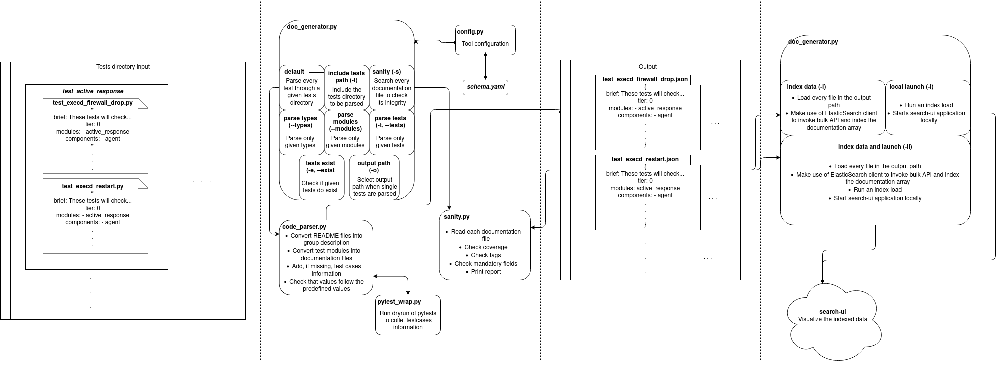

# Wazuh `qa-docs`
Wazuh - Quality Assurance automation self-contained documentation parsing tool.

## Rational
Wazuh QA documentation is designed to be self-contained into the source code of each test.

`qa-docs` is the tool in charge of parsing the documentation block from each source code and generate data capable
to be indexed and displayed. It has two modules well defined: `DocGenerator` and `SearchUI`.

### DocGenerator

It is the module that parses and indexes the data to ElasticSearch.

### SearchUI

It is a search engine that allows to search and visualize the data previously indexed to ElasticSearch.

## Design
### Input
`DocGenerator` parses the information from test files containing a specific comment format:

Each test file has self-contained documentation comment blocks in **YAML** format.

These blocks can contain **Mandatory** and **Optional** fields.
- **Mandatory** fields must be present in the documentation block and will be added to the final
documentation output files.
- **Optional** fields, if present, will be parsed and added to the final documentation output files.

Each test file has a header docstring that details information related to the whole test file.
And each test method inside the file will have a test documentation block with the specific information of
this test.

Additional group information is parsed from the README files found in the repository. Each README file represents
a group, and every test file at the same or lower folder level is considered as belonging to it.

Also, groups could be nested, so a README file found under the level of a group will generate a new group that belongs
to the first one.

The specific content of each block is defined in the [Documentation schema section](https://github.com/wazuh/wazuh-qa/wiki/Documenting-tests-using-the-qadocs-schema)
within the `qa-docs` wiki.

### Parsing
Running `qa-docs` as specified in the [Usage section](#usage) will scan every test and group file found into the
include paths of the documentation, it will extract the module and tests blocks from each test file and discard any
non-documentable field. Also, complementary test-cases information will be extracted from a dry-run of pytest if there
isn´t a description for them.

### Output
The parsed and filtered documentation information will be added to the output folder within `qa-docs` build installation.

Each test file will generate a JSON and a YAML file with the documentation information. Each of these files contains
a structure with the module description and every test function in the module. Each test function
contains its description and, if available, the test-cases information.

These files are ordered in nested folders with the same tree structure as the source code files.

### Sanity Check
After the generation of the documentation output, a sanity check can be executed to identify coverage, tags and
any missing mandatory field.

### Indexing
The JSON files generated by `qa-docs` are intended to be indexed into elasticsearch and later be displayed by the Search-UI App.
So, DocGenerator treats each JSON file as a document that will be added to elasticsearch index.

### Local launch
Together with the Indexing functionality, the tool has the capability to locally lunch SearchUI to visualize the
documentation content into the App UI.

### Diagram


## Content
    ├── wazuh-testing
    .   ├── qa-docs
    .   |   ├── dockerfiles
    .   |   │   ├── qa_docs_base.Dockerfile     | The dockerfile that builds a docker image with the `qa-docs` dependencies properly installed
        |   |   └── qa_docs_tool.Dockerfile     | The dockerfile that builds a docker image with the `qa-docs` running a specific branch
        |   ├── lib
        |   |   ├── __init__.py
        |   │   ├── code_parser.py     | The module in charge of parsing documentation blocks
        |   │   ├── config.py          | The module in charge of parsing the configuration file
        |   |   ├── index_data.py      | The module in charge of the index management
        |   │   ├── pytest_wrap.py     | The module in charge of dry-running pytest to collect complementary information
        |   │   ├── sanity.py          | The module in charge of performing a sanity check
        |   │   └── utils.py           | The module with utility functions
        |   ├── search_ui              | search-ui module directory
        |   ├── __init__.py
        |   ├── deploy_qa_docs.sh               | Script that build the qa-docs images and run them using a specific branch
        |   ├── doc_generator.py                | The main module and the entry point of the tool execution
        |   ├── requirements.txt                | Contais the modules that qa-docs needs
        |   └── schema.yaml                     | The configuration file of the tool
        ├── scripts
        |   ├── qa_docs.py                      | Tool script used by qa framework
        .   .
        .   .

## Schema
The schema file of the tool is located at **qa-docs/schema.yaml**.

The shema fields are specified in the [qa-docs wiki](https://github.com/wazuh/wazuh-qa/wiki/Documenting-tests-using-the-qadocs-schema#schema-blocks)

## Installation

To install `qa-docs` you have to install the wazuh-qa framework by running:

```
python3 setup.py install
```

This `setup.py` is located in `wazuh-qa/deps/wazuh_testing/setup.py`

## Usage

### Dependencies

First of all, the wazuh-qa framework must be installed following the [`installation section`](#installation).
The `requirements.txt` file specifies the required Python modules that need to be installed before running the tool.

Also before indexing is mandatory to have `ElasticSearch` up and running.

##### ES installation on Linux:

- ArchLinux
```
pacman -S elasticsearch
systemctl start elasticsearch.service
```
- Centos
```
yum install elasticsearch-oss.x86_64
systemctl start elasticsearch.service
```
- Ubuntu
```
wget -qO - https://artifacts.elastic.co/GPG-KEY-elasticsearch | sudo apt-key add -
echo "deb https://artifacts.elastic.co/packages/7.x/apt stable main" | sudo tee /etc/apt/sources.list.d/elastic-7.x.list
apt install elasticsearch
systemctl start elasticsearch.service
```

##### ES installation on Windows:
- Using `Chocolatey`

```
choco install elasticsearch
```
##### For more options check the official website:

https://www.elastic.co/es/downloads/elasticsearch

### Parsing

#### Complete run
    qa-docs -I /path-to-tests-to-parse/

Using just the `-I` flag , the tool will load the schema file and run a complete parse of the paths in the
configuration to dump the content into the output folder located in the `qa-docs` build directory.

#### Parse specific type(s)
    qa-docs -I /path-to-tests-to-parse/ --types <TYPE1> <TYPE2>

Using `--type` flag you can parse only the tests inside the type(s) folder(s) you want.

#### Parse specific module(s)
    qa-docs -I /path-to-tests-to-parse/ --types <TYPE1> <TYPE2> --modules <MODULE1> <MODULE2>

Using `--modules` flag you can parse only the tests inside the modules(s) folder(s) you want. It also needs the type of tests where the tests are located.

#### Parse specific test(s)
    qa-docs -I /path-to-tests-to-parse/ -t(--test) TEST_NAME1 TEST_NAME2

Using `-t, --test` flag you can parse only the tests that you want. The documentation parsed will be printed, if you want to save it you have to use the `-o`
flag and specify the output directory. e.g: `qa-docs -I /wazuh-qa/tests/ -t test_cache test_cors -o /tmp`

### Sanity Check
    qa-docs -I /path-to-tests-to-parse/ -s

Using `-s`, the tool will run a sanity check of the content in the output folder.

It will check the coverage of the already parsed files in the **output path** comparing it with the tests found within
the **tests path**.

Also, it will validate that the output files have every Mandatory field and check that the documentation parsed has no
wrong values following the `qa-docs` [predefined values](https://github.com/wazuh/wazuh-qa/wiki/Documenting-tests-using-the-qadocs-schema#pre-defined-values).

### Debug
    qa-docs -I /path-to-tests-to-parse/ -d

Using `-d`, the tool runs in DEBUG mode, logging extra information in the log file(created within the `qa-docs` build directory) or console output.

### Version
    qa-docs -v

Using `-v`, the tool will print its current version.

### Index output data
    qa-docs -I /path-to-tests-to-parse/ -i <INDEX_NAME>

Using `-i` option, the tool indexes the content of each file output as a document into ElasticSearch. The name of the index
must be provided as a parameter.

### Local api launch using index
    qa-docs -I /path-to-tests-to-parse/ -l <INDEX_NAME>

Using `-l` option, the tool launches the application with the index previously indexed. The name of the index must be provided as a parameter.

### Index output data and launch the api
    qa-docs -I /path-to-tests-to-parse/ -il <INDEX_NAME>
    
Using `-il` option, the tool indexes the content of each file output as a document into ElasticSearch and then launches the api. The name of the index must be provided as a parameter.