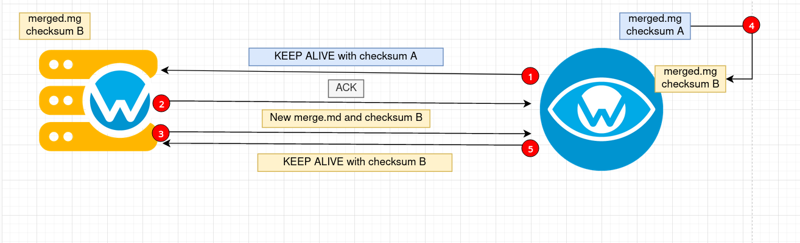

# Test shared configuration push
## Overview
Check if the manager pushes shared configuration to agents as expected.

## Objective

To confirm there are no problems when the manager is supposed to push shared configuration to agents.

By default, agents send a keep alive message to the manager every 10 seconds. For each one of these messages,
the Manager needs to check if the configuration for agent's groups have changed. If so, then the Wazuh Manager 
must push the new effective configuration (`merged.mg` file) for the agent. It must be pushed only once.

If the agent is added to a new group, a new `merged.mg` file must be generated for this agent and pushed as well.

## General info

To avoid race conditions problems, the keep_alive module module on agent_simulator is disabled and the keep_alive 
messages are sent manually. This avoids the scenario where keep_alive thread sends two messages with the same
deprecated checksum while the process_message thread updates such checksum. This would cause an error because the
manager would send to the agent the shared configuration twice and it shouldn't.

|Tier | Number of tests | Time spent |
|:--:|:--:|:--:|
| 0 | 3 | 80s |

## Expected behavior
- Fail if remoted doesn't send the up file command.
- Fail if remoted doesn't push the shared configuration when required.
  Fail if remoted doesn't send the close file command.
  Fail if remoted push the same shared configuration twice.
  Fail if remoted doesn't push a new shared configuration after adding the agent to a new group.
- Fail if remoted doesn't return an error message when the agent is disconnected.
- Fail if remoted couldn't connect with an active agent.
## Testing

The testing is based on configuring the manager to receive messages via `TCP`, `UDP` and `TCP-UDP` using default ports.
  
It simulates a new agent registered to the Manager who sends some keep_alive messages. The check waits until Manager and
Agent share some expected messages:

    1. Agent send keep-alive msg with their checksum (A).
    2. Manager sends ACK message as the keep-alive have been received.
    3. Manager compares the received checksum with the stored one, as they differ, sends the new file with the new checksum.
    4. The simulated agent updates his checksum (and simulates a restart).
    5. Agent sends the new updated checksum with the keep_alive.
    6. Manager should not push the configuration again.
    7. After adding a new group to the agent, a new shared configuration must be pushed from the Manager.

## Code documentation
::: tests.integration.test_remoted.test_agent_communication.test_request_agent_info
